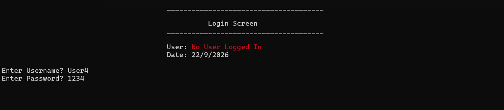
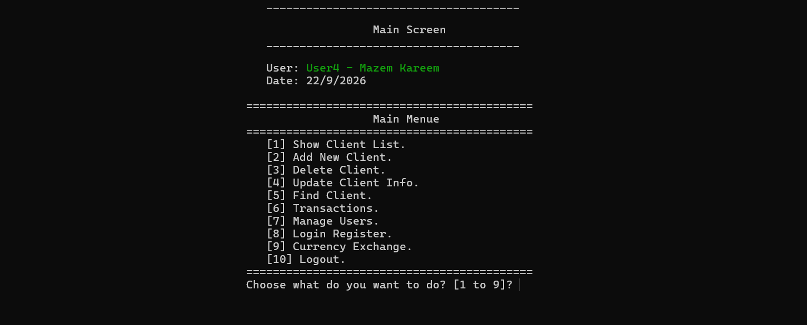
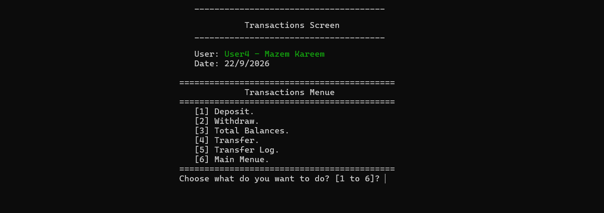
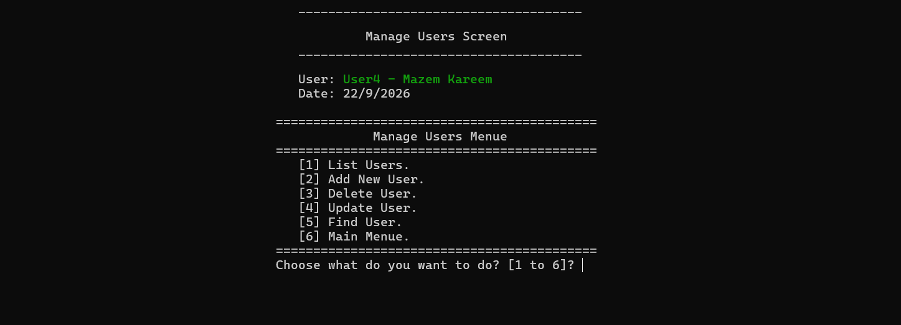
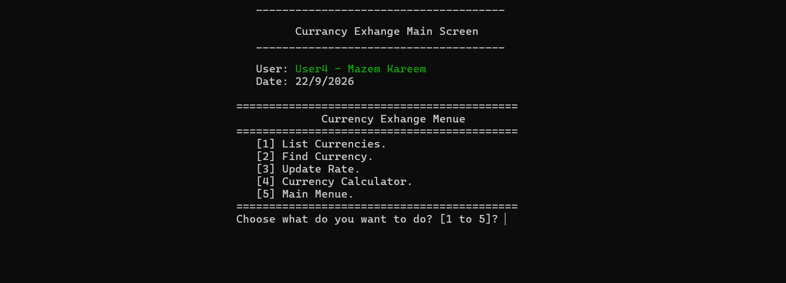

# 🏦 Bank Management System

A complete banking system developed in C++, built on object-oriented programming (OOP) principles and a layered architecture, with full support for managing clients, users, transfers, and currency exchange.

---

## 📖 Overview

This project is a realistic simulation of a complete banking system, designed to reflect a professional engineering mindset in building software systems. It goes beyond implementing basic banking operations, showcasing a practical and refined application of object-oriented programming principles (Encapsulation, Inheritance, Polymorphism, Abstraction), alongside a clear architecture that separates business logic from the presentation layer, an encryption system that protects sensitive data, and a strict validation mechanism applied at every stage of the application.

1. The system relies entirely on text files to store and manage data without the need for any external database, with automatic encryption of sensitive data upon storage and decryption upon retrieval.

2. The system supports transferring funds between accounts with full documentation of each operation, in addition to a currency conversion calculator that uses the US Dollar as a base currency for converting between any two currencies.

3. The system also maintains detailed logs for every financial transfer and every login attempt, recording the timestamp, amounts, and accounts involved.

4. The system also provides a mechanism for managing users and granting them specific access permissions based on their role, ensuring that certain sensitive operations are restricted to authorized users only.

---

## 🖼️ System Screenshots

### Login Screen

### Main Screen

### Transactions Screen

### Manage Users Screen

### Currency Exchange Screen

---

## ✨ Key Features

### 👥 Client Management
- Display a complete, well-organized list of all clients.
- Add a new client with automatic validation to prevent duplicate account numbers.
- Edit client information (name, email, phone number, PIN code, balance).
- Search for a client by account number.
- Delete a client with confirmation before final execution.

### 💰 Transactions & Transfers
- Perform deposit and withdrawal operations with balance sufficiency checks.
- Display individual and total balances across the bank.
- Transfer funds between accounts.
- Document every transfer operation in a dedicated log showing timestamp, accounts, and amounts.

### 💱 Currency Exchange
- Display the list of supported currencies and their exchange rates against the US Dollar.
- Search for a currency by its code or country name.
- Update exchange rates and save them automatically.
- A calculator for converting amounts between any two currencies.

### 🔐 Authentication & User Management
- Secure login with different permission levels for each user.
- Log every login attempt along with its timestamp.
- Add, edit, and delete users, and define their access permissions.
- Automatically display the logged-in user's name and the current date on screen.

---

## 🏗️ Architecture & Technical Highlights

### Object-Oriented Programming (OOP) Principles
The system is built entirely on the core principles of object-oriented programming. All interface screens inherit from a unified abstract base class responsible for rendering menus and verifying permissions, while polymorphism is applied to allow each screen to implement its own specific behavior without code duplication. Internal data for each class (such as client, user, or currency data) is encapsulated and made accessible only through well-defined public methods, with access modifiers used deliberately to control what can be accessed from outside the class.

### Layered Architecture
Business logic and processing are completely separated from the presentation and interface layer, so that interface screens contain no direct processing logic and rely entirely on the classes responsible for data and operations. This separation makes each layer independently maintainable and extendable without affecting the others.

### Input Validation Engine
A dedicated validation engine is used throughout the system to prevent invalid data entry, along with precise handling of data types and conversions, protecting the system from runtime errors and ensuring the integrity of stored data.

### Data Encryption & Storage
Sensitive data is encrypted before being saved to text files and automatically decrypted upon reading. The system relies entirely on organized text files to store and retrieve data without the need for any external database.

---

## 🧭 The Five Main Screens

The system consists of five main leading screens that manage all parts of the application, each responsible for a specific part of the system with its own interface and permissions:

1. **Login Screen** — The system's first gateway, providing secure authentication based on username and encrypted password, along with logging of login attempts.

2. **Main Screen** — The application's central menu, offering 10 main options for navigating all sections of the system.

3. **Transactions Main Screen** — Responsible for managing all financial operations (withdrawal, deposit, total balances, transfers between accounts, and viewing the transfer log).

4. **Manage Users Main Screen** — A dedicated control panel for managing bank employees and users (add, edit, search, delete, and define permissions).

5. **Currency Exchange Main Screen** — Responsible for displaying currencies, searching for them, updating exchange rates, and performing conversions through the currency calculator.

---

## 🛠️ Tools & Technologies

- **Language:** C++
- **IDE:** Microsoft Visual Studio
- **Version Control:** Git & GitHub
- **Data Storage:** Text files used as the primary means of storing and retrieving data